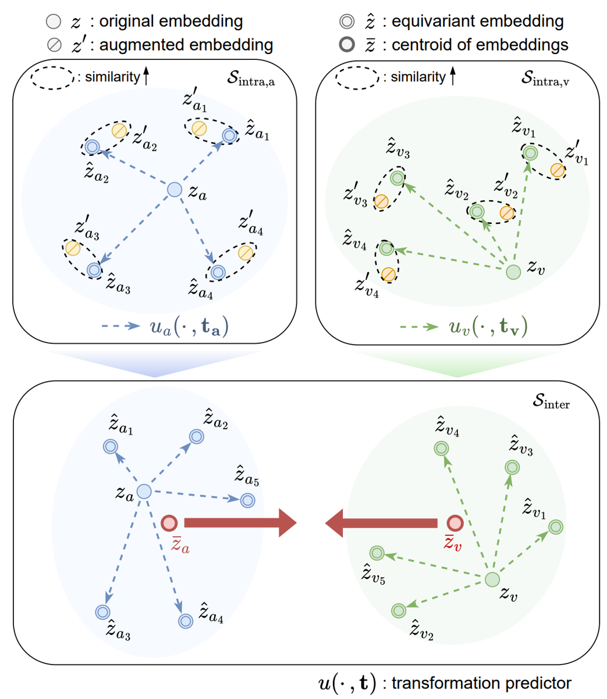

# EquiAV: Leveraging Equivariance for Audio-Visual Contrastive Learning


[](https://lbesson.mit-license.org/)
[](https://www.python.org/downloads/release/python-311/)
[](https://pytorch.org/get-started/previous-versions/#v21)

This repository contains the source code of our paper [EquiAV:Leveraging Equivariance for Audio-Visual Contrastive Learning](https://arxiv.org/abs/2403.09502) (ICML2024). You can also check out the introduction video of the paper [here](https://youtu.be/BJ8Mt4qGn5c).


## Abstract
<p align="center">

Recent advancements in self-supervised audio-visual representation learning have demonstrated its potential to capture rich and comprehensive representations. However, despite the advantages of data augmentation verified in many learning methods, audio-visual learning has struggled to fully harness these benefits, as augmentations can easily disrupt the correspondence between input pairs. To address this limitation, we introduce EquiAV, a novel framework that leverages equivariance for audio-visual contrastive learning. Our approach begins with extending equivariance to audio-visual learning, facilitated by a shared attention-based transformation predictor. It enables the aggregation of features from diverse augmentations into a representative embedding, providing robust supervision. Notably, this is achieved with minimal computational overhead. Extensive ablation studies and qualitative results verify the effectiveness of our method. EquiAV outperforms previous works across various audio-visual benchmarks.

## Getting Started
### 1. Prepare Environment & Dataset
Create conda environment
```
conda env create -f equiav.yaml
conda activate equiAV
```

Please prepare the pretrain and finetuning datasets. The folder structure does not matter, but create a JSON file for each dataset to use. The format of the JSON file is as follows:

```
{
 "data": [
  {
   "video_id": "--4gqARaEJE_0_10000",
   "wav": [path to wav file],
   "video_path": [path to video file],
   "labels": [label] # ex. "/m/068hy,/m/07q6cd_,/m/0bt9lr,/m/0jbk"
  },
  {
   "video_id": "--BfvyPmVMo_20000_30000",
   "wav": [path to wav file],
   "video_path": [path to video file],
   "labels": [label] # ex. "/m/03l9g"
  },
  ...
 ]
}
```

Additionally, these JSON files should be located within the **datasets/dataprep** folder. Under this folder, subfolders should be organized by dataset as follows:

```
EquiAV/
├── datasets/
|   ├── AudioVisual.py
│   └── dataprep/
│       └── AudioSet_2M/    
│           ├── train.json
│           ├── test.json
│           ├── audioset_for_retrieval.json
│           ├── class_label_indices.csv
│           └── weights.csv 
│       └── AudioSet_20K/   
│           ├── train.json
│           ├── test.json
│           └── class_label_indices.csv
│       └── VGGSound/       
│           ├── train.json
│           ├── test.json
│           ├── VGGSound_for_retrieval.json
│           ├── class_label_indices.csv
│           └── weights.csv 
├── loss/
├── models/
├── optimizer/
├── pretrained_weights/
|   ├── mae_pretrain_vit_base.pth
...
```
Since the amount of data may vary depending on when it is downloaded, we recommend configuring a JSON file that suits your environment. We release the data list we used as follows. The weight files, label CSV files, and the set used for retrieval follow the excellent previous work by [CAV-MAE](https://github.com/YuanGongND/cav-mae). You can also find the detail for preprocessing in this repository, and special thanks to the authors of CAV-MAE.

**JSON File link**

|          Dataset       |                              Content                             |
|:-------------------------:|:----------------------------------------------------------------:|
|   [AudioSet-2M](https://drive.google.com/drive/folders/1Nqz41Y-QS5FPsrgkkCIKLsL51m1HruA5?usp=drive_link)   |   (JSON) train, test, retrieval (CSV) weight, label  |
|   [AudioSet-20K](https://drive.google.com/drive/folders/1kxjzTjUR4k-68otIhzTP2UaZc9vHusR2?usp=drive_link)  |        (JSON) train, test (CSV) label       |
|   [VGGSound](https://drive.google.com/drive/folders/1rLv8fTpUNqkdQjD3T6RT5iHpGFmv1erG?usp=sharing)   |   (JSON) train, test, retrieval (CSV) weight, label   |


### 2. Pre-training

We pretrain our model on a single node environment with 8 multi-GPUs. We use the ViT-B/16 model as the backbone model, and initialized it with an ImageNet self-supervised pretrained model for the visual and audio domain backbones. The link to this model is [here](https://dl.fbaipublicfiles.com/mae/pretrain/mae_pretrain_vit_base.pth).

```
python pt_main.py \
    --gpu '0,1,2,3,4,5,6,7' \
    --model 'pt_EquiAV' \
    --dataset 'AudioSet_2M' \
    --audio_pretrained_encoder [path to SSL pretrained model] \
    --visual_pretrained_encoder [path to SSL pretrained model] \
    --max_epoch 20 \
    --warmup_epoch 2 \
    --aug_size_a 24 --aug_size_v 18 \
    --batch_size 16 \
    --lr 1e-4 \
    --cen_mean True \
    --cen_num 16 \
    --save_path [path to save model] \
    --no_wandb
```
Our pre-trained model can be downloaded from [here](https://docs.google.com/uc?export=download&id=1QCvBcu-CAXFLKqfk0G7niO2JO5kf74K6).

For zero-shot retrieval tasks, For the zero-shot retrieval task, you can manually modify the **retrieval.py** file.
```
python retireval.py     # Fill in lines 129, 136, and 137 to suit your environment. 
```
### 3. Fine-tuning
Use the script below to perform finetuning according to desired **dataset**(AudioSet2M, AudioSet20K, VGGSound) and **mode**(multimodal, audio_only, video_only).

```
python ft_main.py \
    --gpu '0,1,2,3,4,5,6,7' \
    --model 'ft_EquiAV' \
    --dataset [finetuning dataset] \
    --pretrained_model [path to EquiAV pretrained] \
    --max_epoch 50 \
    --warmup_epoch 1 \
    --batch_size 32 \
    --trainfunc_ft bceloss \
    --lr 1e-4 \
    --ftmode [ftmode] \
    --save_path [path to save model] \
    --no_wandb
```
